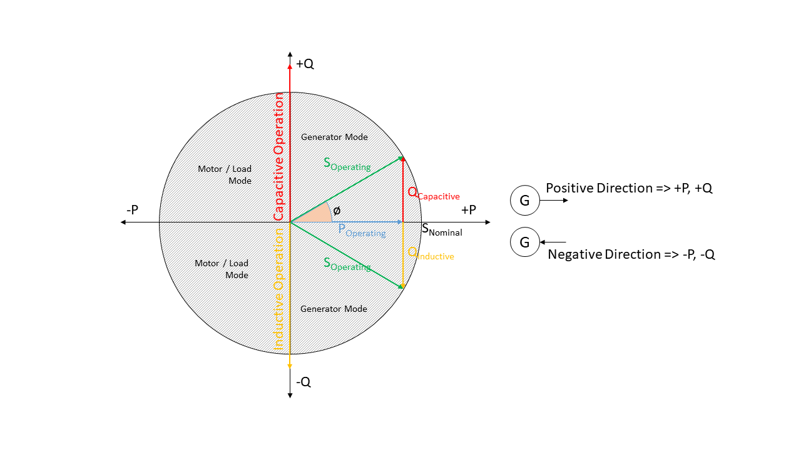
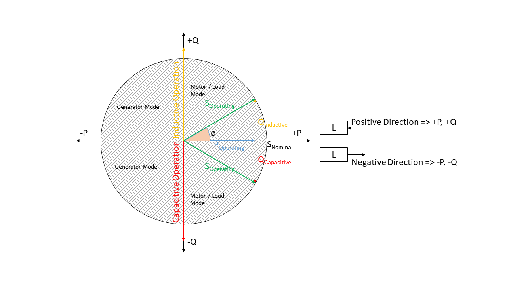

Definition and units
====================

Sign Convention
---------------

Generators and Loads in an AC power system can behave either like an inductor or a capacitor. Mathematically,
this has two different sign conventions, either from the generator perspective or from the load perspective.
This is defined by the direction of power flow from the component.

Both sign conventions are used in eDisGo depending upon the components being defined, similar to pypsa.

Generator Sign Convention
^^^^^^^^^^^^^^^^^^^^^^^^^
.. _generator_sign_convention_label:

    Generator sign convention in detail

While defining time series for :class:`~.grid.components.Generator`, :class:`~.grid.components.GeneratorFluctuating`,
and :class:`~.grid.components.Storage`, the generator sign convention is used.

Load Sign Convention
^^^^^^^^^^^^^^^^^^^^
.. _load_sign_convention_label:

    Load sign convention in detail

The time series for :class:`~.grid.components.Load` is defined using the load sign convention.

Reactive Power Sign Convention
------------------------------

Generators and Loads in an AC power system can behave either like an inductor or a capacitor. Mathematically,
this has two different sign conventions, either from the generator perspective or from the load perspective.

Both sign conventions are used in eDisGo, similar to pypsa. While defining time series for
:class:`~.grid.components.Generator`, :class:`~.grid.components.GeneratorFluctuating`, and
:class:`~.grid.components.Storage`, the generator sign convention is used. This means that when
the reactive power (Q) is positive, the component shows capacitive behaviour and when the reactive power (Q) is
negative, the component shows inductive behaviour.

The time series for :class:`~.grid.components.Load` is defined using the load sign convention. This means
that when the reactive power (Q) is positive, the component shows inductive behaviour and when the
reactive power (Q) is negative, the component shows capacitive behaviour. This is the direct opposite of the
generator sign convention.

Units
-----
.. csv-table:: List of variables and units
   :file: units_table.csv
   :delim: ;
   :header-rows: 1
   :widths: 5, 1, 1, 5
   :stub-columns: 0