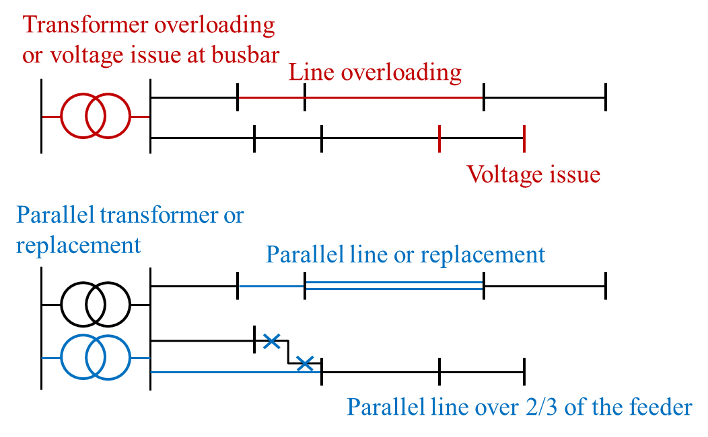

.. _features-in-detail:

Features in detail
==================

Power flow analysis
-------------------

In order to analyse voltages and line loadings a non-linear power flow analysis (PF) using pypsa is conducted.
All loads and generators are modelled as PQ nodes. The slack is positioned at the substation's secondary side.

Multi period optimal power flow
---------------------------------

.. warning:: The non-linear optimal power flow is currently not maintained and might not work out of the box!

.. todo:: Add

.. _grid_expansion_methodology:

Grid expansion
-------------------------

General methodology
^^^^^^^^^^^^^^^^^^^^^^^^^^

The grid expansion methodology is conducted in :py:func:`~edisgo.flex_opt.reinforce_grid.reinforce_grid`.

The order grid expansion measures are conducted is as follows:

* Reinforce stations and lines due to overloading issues
* Reinforce lines in MV grid due to voltage issues
* Reinforce distribution substations due to voltage issues
* Reinforce lines in LV grid due to voltage issues
* Reinforce stations and lines due to overloading issues

Reinforcement of stations and lines due to overloading issues is performed twice, once in the beginning and again after fixing voltage issues,
as the changed power flows after reinforcing the grid may lead to new overloading issues. How voltage and overloading issues are identified and
solved is shown in figure :ref:`grid_expansion_measures_fig` and further explained in the following sections.

.. _grid_expansion_measures_fig:

   Grid expansion measures

:py:func:`~edisgo.flex_opt.reinforce_grid.reinforce_grid` offers a few additional options. It is e.g. possible to conduct grid
reinforcement measures on a copy
of the graph so that the original grid topology is not changed. It is also possible to only identify necessary
reinforcement measures for two worst-case snapshots in order to save computing time and to set combined or separate
allowed voltage deviation limits for MV and LV.
See documentation of :py:func:`~edisgo.flex_opt.reinforce_grid.reinforce_grid` for more information.

Identification of overloading and voltage issues
^^^^^^^^^^^^^^^^^^^^^^^^^^^^^^^^^^^^^^^^^^^^^^^^^^^^^^^^

Identification of overloading and voltage issues is conducted in
:py:mod:`~edisgo.flex_opt.check_tech_constraints`.

Voltage issues are determined based on allowed voltage deviations set in the config file
:ref:`config_grid_expansion` in section `grid_expansion_allowed_voltage_deviations`. It is possible
to set one allowed voltage deviation that is used for MV and LV or define separate allowed voltage deviations.
Which allowed voltage deviation is used is defined through the parameter *split_voltage_band* of :py:func:`~edisgo.flex_opt.reinforce_grid.reinforce_grid`.
By default *split_voltage_band* is set to True, resulting in separate voltage limits for MV and LV, as a combined limits
may currently lead to problems if voltage deviation in MV grid is already close to the allowed limit, in which case the remaining allowed voltage deviation in the LV grids is close to zero.

Overloading is determined based on allowed load factors that are also defined in the config file
:ref:`config_grid_expansion` in section `grid_expansion_load_factors`.

Allowed voltage deviations as well as load factors are in most cases different for load and feed-in case.
Load and feed-in case are commonly used worst-cases for grid expansion analyses.
Load case defines a situation where all loads in the grid have a high demand while feed-in by generators is low
or zero. In this case power is flowing from the high-voltage grid to the distribution grid.
In the feed-in case there is a high generator feed-in and a small energy demand leading to a reversed power flow.
Load and generation assumptions for the two worst-cases are definded in the config file
:ref:`config_timeseries` in section `worst_case_scale_factor` (scale factors describe actual power
to nominal power ratio of generators and loads).

When conducting grid reinforcement based on given time series instead of worst-case assumptions, load and feed-in
case also need to be definded to determine allowed voltage deviations and load factors.
Therefore, the two cases are identified based on the generation and load time series of all loads and generators
in the grid and defined as follows:

* Load case: positive ( :math:`\sum load` - :math:`\sum generation` )
* Feed-in case: negative ( :math:`\sum load` - :math:`\sum generation` ) -> reverse power flow at HV/MV substation

Grid losses are not taken into account. See :meth:`~edisgo.network.timeseries.TimeSeries.timesteps_load_feedin_case` for more
details and implementation.

Check line load
""""""""""""""""""

    Exceedance of allowed line load of MV and LV lines is checked in :py:func:`~edisgo.flex_opt.check_tech_constraints.mv_line_overload` and
    :py:func:`~edisgo.flex_opt.check_tech_constraints.lv_line_oveload`, respectively.
    The functions use the given load factor and the maximum allowed current given by the manufacturer (see *I_max_th* in tables :ref:`lv_cables_table`,
    :ref:`mv_cables_table` and :ref:`mv_lines_table`) to calculate the allowed
    line load of each LV and MV line. If the line load calculated in the power flow analysis exceeds the allowed line
    load, the line is reinforced (see :ref:`grid-expansion-measure-line-load-label`).

Check station load
""""""""""""""""""""

    Exceedance of allowed station load of HV/MV and MV/LV stations is checked in :py:func:`~edisgo.flex_opt.check_tech_constraints.hv_mv_station_overload` and
    :py:func:`~edisgo.flex_opt.check_tech_constraints.mv_lv_station_overload`, respectively.
    The functions use the given load factor and the maximum allowed apparent power given by the manufacturer (see *S_nom* in tables :ref:`lv_transformers_table`,
    and :ref:`mv_transformers_table`) to calculate the allowed
    apparent power of the stations. If the apparent power calculated in the power flow analysis exceeds the allowed apparent power the station is reinforced
    (see :ref:`grid-expansion-measure-station-load-label`).

Check line and station voltage deviation
""""""""""""""""""""""""""""""""""""""""""

  Compliance with allowed voltage deviation limits in MV and LV grids is checked in :py:func:`~edisgo.flex_opt.check_tech_constraints.mv_voltage_issue` and
  :py:func:`~edisgo.flex_opt.check_tech_constraints.lv_voltage_issue`, respectively.
  The functions check if the voltage deviation at a node calculated in the power flow analysis exceeds the allowed voltage deviation. If it does,
  the line is reinforced (see :ref:`grid-expansion-measure-lv-station-voltage-label` or
  :ref:`grid-expansion-measure-line-voltage-label`).

Grid expansion measures
^^^^^^^^^^^^^^^^^^^^^^^^^^

Reinforcement measures are conducted in :py:mod:`~edisgo.flex_opt.reinforce_measures`. Whereas overloading issues can usually be solved in one step, except for
some cases where the lowered grid impedance through reinforcement measures leads to new issues, voltage issues can only be solved iteratively. This means that after each reinforcement
step a power flow analysis is conducted and the voltage rechecked. An upper limit for how many iteration steps should be performed is set in order to avoid endless iteration. By
default it is set to 10 but can be changed using the parameter *max_while_iterations* of :py:func:`~edisgo.flex_opt.reinforce_grid.reinforce_grid`.

.. _grid-expansion-measure-line-load-label:

Reinforce lines due to overloading issues
"""""""""""""""""""""""""""""""""""""""""""""

  Line reinforcement due to overloading is conducted in :py:func:`~edisgo.flex_opt.reinforce_measures.reinforce_lines_overloading`.
  In a first step a parallel line of the same line type is installed. If this does not solve the overloading issue as many parallel standard lines as needed are installed.

.. _grid-expansion-measure-station-load-label:

Reinforce stations due to overloading issues
"""""""""""""""""""""""""""""""""""""""""""""""""""""

  Reinforcement of HV/MV and MV/LV stations due to overloading is conducted in :py:func:`~edisgo.flex_opt.reinforce_measures.reinforce_hv_mv_station_overloading` and
  :py:func:`~edisgo.flex_opt.reinforce_measures.reinforce_mv_lv_station_overloading`, respectively.
  In a first step a parallel transformer of the same type as the existing transformer is installed. If there is more than one transformer in the station the smallest transformer
  that will solve the overloading issue is used. If this does not solve the overloading issue as many parallel standard transformers as needed are installed.

.. _grid-expansion-measure-lv-station-voltage-label:

Reinforce MV/LV stations due to voltage issues
"""""""""""""""""""""""""""""""""""""""""""""""""""""

  Reinforcement of MV/LV stations due to voltage issues is conducted in :py:func:`~edisgo.flex_opt.reinforce_measures.reinforce_mv_lv_station_voltage_issues`.
  To solve voltage issues, a parallel standard transformer is installed.

  After each station with voltage issues is reinforced, a power flow analysis is conducted and the voltage rechecked. If there are still voltage issues
  the process of installing
  a parallel standard transformer and conducting a power flow analysis is repeated until voltage issues are solved or until the maximum number of allowed iterations is reached.

.. _grid-expansion-measure-line-voltage-label:

Reinforce lines due to voltage
"""""""""""""""""""""""""""""""""""""""""""""""""""""

  Reinforcement of lines due to voltage issues is conducted in :py:func:`~edisgo.flex_opt.reinforce_measures.reinforce_lines_voltage_issues`.
  In the case of several voltage issues the path to the node with the highest voltage deviation is reinforced first. Therefore, the line between the secondary side of the station and the
  node with the highest voltage deviation is disconnected at a distribution substation after 2/3 of the path length. If there is no distribution substation where the line can be
  disconnected, the node is directly connected to the busbar. If the node is already directly connected to the busbar a parallel standard line is installed.

  Only one voltage problem for each feeder is considered at a time since each measure effects the voltage of each node in that feeder.

  After each feeder with voltage problems has been considered, a power flow analysis is conducted and the voltage rechecked. The process of solving voltage issues is repeated until voltage issues are solved
  or until the maximum number of allowed iterations is reached.

Grid expansion costs
^^^^^^^^^^^^^^^^^^^^^^^^^^

Total grid expansion costs are the sum of costs for each added transformer and line.
Costs for lines and transformers are only distinguished by the voltage level they are installed in
and not by the different types.
In the case of lines it is further taken into account wether the line is installed in a rural or an urban area, whereas rural areas
are areas with a population density smaller or equal to 500 people per km² and urban areas are defined as areas
with a population density higher than 500 people per km² [DENA]_.
The population density is calculated by the population and area of the grid district the line is in (See :class:`~.grid.grids.Grid`).

Costs for lines of aggregated loads and generators are not considered in the costs calculation since grids of
aggregated areas are not modeled but aggregated loads and generators are directly connected to the MV busbar.

.. _curtailment_in_detail-label:

Curtailment
-----------

.. warning:: The curtailment methods are not yet adapted to the refactored code and therefore currently do not work.

eDisGo right now provides two curtailment methodologies called 'feedin-proportional' and 'voltage-based', that are implemented in
:py:mod:`~edisgo.flex_opt.curtailment`.
Both methods are intended to take a given curtailment target obtained from an optimization of the EHV and HV grids using
`eTraGo <https://github.com/openego/eTraGo>`_ and allocate it to the generation units in the grids. Curtailment targets can be specified for all
wind and solar generators,
by generator type (solar or wind) or by generator type in a given weather cell.
It is also possible to curtail specific generators internally, though a user friendly implementation is still in the works.

'feedin-proportional'
^^^^^^^^^^^^^^^^^^^^^^^^

    The 'feedin-proportional' curtailment is implemented in :py:func:`~edisgo.flex_opt.curtailment.feedin_proportional`.
    The curtailment that has to be met in each time step is allocated equally to all generators depending on their share of total
    feed-in in that time step.

    .. math::
        c_{g,t} = \frac{a_{g,t}}{\sum\limits_{g \in gens} a_{g,t}} \times  c_{target,t} ~ ~ \forall t\in timesteps

    where :math:`c_{g,t}` is the curtailed power of generator :math:`g` in timestep :math:`t`, :math:`a_{g,t}` is the weather-dependent availability
    of generator :math:`g` in timestep :math:`t` and :math:`c_{target,t}` is the given curtailment target (power) for timestep :math:`t` to be allocated
    to the generators.

'voltage-based'
^^^^^^^^^^^^^^^^^^^^^^^^

    The 'voltage-based' curtailment is implemented in :py:func:`~edisgo.flex_opt.curtailment.voltage_based`.
    The curtailment that has to be met in each time step is allocated to all generators depending on
    the exceedance of the allowed voltage deviation at the nodes of the generators. The higher the exceedance, the higher
    the curtailment.

    The optional parameter *voltage_threshold* specifies the threshold for the exceedance of the allowed voltage deviation above
    which a generator is curtailed. By default it is set to zero, meaning that all generators at nodes with voltage deviations
    that exceed the allowed voltage deviation are curtailed. Generators at nodes where the allowed voltage deviation is not
    exceeded are not curtailed. In the case that the required
    curtailment exceeds the weather-dependent availability of all generators with voltage deviations above the specified threshold,
    the voltage threshold is lowered in steps of 0.01 p.u. until the curtailment target can be met.

    Above the threshold, the curtailment is proportional to the exceedance of the allowed voltage deviation.

    .. math::
        \frac{c_{g,t}}{a_{g,t}} = n \cdot (V_{g,t} - V_{threshold, g, t}) + offset

    where :math:`c_{g,t}` is the curtailed power of generator :math:`g` in timestep :math:`t`, :math:`a_{g,t}` is the weather-dependent availability
    of generator :math:`g` in timestep :math:`t`, :math:`V_{g,t}` is the voltage at generator :math:`g` in timestep :math:`t` and
    :math:`V_{threshold, g, t}` is the voltage threshold for generator :math:`g` in timestep :math:`t`. :math:`V_{threshold, g, t}` is calculated as follows:

    .. math::
        V_{threshold, g, t} = V_{g_{station}, t} + \Delta V_{g_{allowed}} + \Delta V_{offset, t}

    where :math:`V_{g_{station}, t}` is the voltage at the station's secondary side, :math:`\Delta V_{g_{allowed}}` is the allowed voltage
    deviation in the reverse power flow and :math:`\Delta V_{offset, t}` is the exceedance of the allowed voltage deviation above which generators are curtailed.

    :math:`n` and :math:`offset` in the equation above are slope and y-intercept of a linear relation between
    the curtailment and the exceedance of the allowed voltage deviation. They are calculated by solving the following linear problem that penalizes the offset
    using the python package pyomo:

    .. math::
        min \left(\sum\limits_{t} offset_t\right)

    .. math::
        s.t. \sum\limits_{g} c_{g,t} = c_{target,t} ~ \forall g \in (solar, wind) \\
         c_{g,t} \leq a_{g,t}  \forall g \in (solar, wind),t

    where :math:`c_{target,t}` is the given curtailment target (power) for timestep :math:`t` to be allocated
    to the generators.

.. _electromobility-integration-label:

Electromobility integration
----------------------------

The import and integration of electromobility data is implemented in :py:func:`~edisgo.io.electromobility_import`.

Allocation of charging demand
^^^^^^^^^^^^^^^^^^^^^^^^^^^^^^

The allocation of charging processes to charging stations is implemented in
:py:func:`~edisgo.io.electromobility_import.distribute_charging_demand`.
After electromobility data is loaded, the charging demand from SimBEV is allocated to potential charging parks
from TracBEV. The allocation of the charging processes to the charging infrastructure is carried out with the
help of the weighting factor of the potential charging parks determined by TracBEV. This involves a random and
weighted selection of one charging park per charging process. In the case of private charging infrastructure, a
separate charging point is set up for each electric vehicle (EV). All charging processes of the respective EV and charging use case
are assigned to this charging point. The allocation of private charging processes to charging stations is
implemented in :py:func:`~edisgo.io.electromobility_import.distribute_private_charging_demand`.

For public charging infrastructure, the allocation is made explicitly per charging process. For each charging
process it is determined whether a suitable charging point is already available. For this purpose it is checked
whether the charging point is occupied by another EV in the corresponding period and whether it can provide the
corresponding charging capacity. If no suitable charging point is available, a charging point is determined
randomly and weighted in the same way as for private charging. The allocation of public charging processes to
charging stations is implemented in :py:func:`~edisgo.io.electromobility_import.distribute_public_charging_demand`.

.. _charging_strategies-label:

Charging strategies
^^^^^^^^^^^^^^^^^^^^^^^^

eDisGo right now provides three charging strategy methodologies called 'dumb', 'reduced' and 'residual', that
are implemented in :py:mod:`~edisgo.flex_opt.charging_strategies`.
The aim of the charging strategies 'reduced' and 'residual' is to generate the most grid-friendly charging behavior possible without
restricting the convenience for end users. Therefore, the boundary condition of all charging strategies is that
the charging requirement of each charging process must be fully covered. This means that charging processes can
only be flexibilised if the EV can be fully charged while it is stationary. Furthermore, only private
charging processes can be used as a flexibility, since the fulfillment of the service is the priority for public
charging processes.

'dumb'
""""""""""""""""""
In this charging strategy the cars are charged directly after arrival with the maximum possible charging capacity.

'reduced'
""""""""""""""""""
This is a preventive charging strategy. The cars are charged directly after arrival with the minimum possible
charging power. The minimum possible charging power is determined by the parking time and the parameter
minimum_charging_capacity_factor.

'residual'
""""""""""""""""""
This is an active charging strategy. The cars are charged when the residual load in the MV grid is lowest
(high generation and low consumption). Charging processes with a low flexibility are given priority.

.. _storage-integration-label:

Storage integration
--------------------

.. warning:: The storage integration methods described below are not yet adapted to the refactored code and therefore currently do not work.

Besides the possibility to connect a storage with a given operation to any node in the
grid, eDisGo provides a methodology that takes
a given storage capacity and allocates it to multiple smaller storage units such that it
reduces line overloading and voltage deviations.
The methodology is implemented in :py:func:`~edisgo.flex_opt.storage_positioning.one_storage_per_feeder`.
As the above described
curtailment allocation methodologies it is intended to be used in combination
with `eTraGo <https://github.com/openego/eTraGo>`_ where
storage capacity and operation is optimized.

For each feeder with load or voltage issues it is checked if integrating a
storage will reduce peaks in the feeder, starting with the feeder with
the highest theoretical grid expansion costs. A heuristic approach is used
to estimate storage sizing and siting while storage operation is carried
over from the given storage operation.

A more thorough documentation will follow soon.

Spatial complexity reduction
----------------------------
eDisGo offers several methods for spatial complexity reduction. The methods reduce the number of nodes in the grid
through a spatial clustering. For all methods it is a two-step procedure. At first, a busmap is determined,
mapping each bus in the original grid to a new bus in the clustered grid. Then, according to
the busmap, the eDisGo object is reduced. Some parts of the methods are based on the spatial clustering of [PyPSA]_.

You can apply the complexity reduction by calling the function
:py:attr:`~EDisGo.spatial_complexity_reduction`.

Important is that all grid buses have coordinates and the line length can be calculated through the Euclidean distance
and a detour factor. If the grids do not match these conditions, the complexity reduction might not work as expected.
If your grid does not have coordinates, you can calculate new coordinates by setting the parameter
'apply_pseudo_coordinates' to True (which is the default).
Then coordinates for the grids are calculated based on the tree/radial topology of the grid graph.

The methods are selected through the 'mode' parameter. There are four methods implemented: 'kmeans', 'kmeansdijkstra',
'aggregate_to_main_feeder' and 'equidistant_nodes'. Every node of the grid is assigned to a new node with new
coordinates.

    *   'kmeans' - Assignment to cluster centers of the K-Means clustering.
    *   'kmeansdijkstra' - Assignment to the nearest nodes of the cluster center through the distance in the graph.
        For distance calculation, the Dijkstra algorithm is used.
    *   'aggregate_to_main_feeder' - Assignment to the nearest node of the main feeder.
    *   'equidistant_nodes' - Distribute nodes equidistant on the main feeder and then assign main feeder nodes
        to the new nodes.

Different cluster areas can be selected through the parameter 'cluster_area'.
The cluster area is the area on which the clustering method is applied.
You can choose between: 'grid', 'feeder' and 'main_feeder'. The main feeder is defined as the longest path in
the feeder and is calculated with the method 'aggregate_to_main_feeder'.

The reduction factor describes how great the reduction of nodes is and can be set through the
parameter 'reduction_factor'. A small reduction factor leads to a big reduction
of the number of nodes and vice versa.

.. math::
    n_\mathrm{buses} = k_\mathrm{reduction} \cdot n_\mathrm{buses cluster area}

Also, there is the possibility to reduce the number of nodes to a larger degree in areas with no predicted reinforcement
through the parameter 'reduction_factor_not_focused'.
The areas which are not focused, are
the areas that do not have components with voltage and overloading problems in the worst case power flow.

For the reduction of the grid graph, the function :py:func:`~edisgo.tools.spatial_complexity_reduction.apply_busmap` is used.
With this method, every line and all their
parameters are recalculated and sometimes lines are combined to a new line. This is the part where the magic of
reducing the grid object happens. For more information, read: [HoerschBrown]_ and [SCR]_.

If you want more flexibility in using the complexity reduction, you can also run the functions manually:

.. code-block:: python

    from edisgo.tools.spatial_complexity_reduction import make_busmap, apply_busmap
    from edisgo.tools.pseudo_coordinates import make_pseudo_coordinates

    # create pseudo coordinates
    edisgo_obj = make_pseudo_coordinates(edisgo_obj)

    # determine busmap
    busmap_df = make_busmap(
        edisgo_obj,
        mode=mode,  # 'kmeans', 'kmeansdijkstra', 'aggregate_to_main_feeder' or 'equidistant_nodes'
        cluster_area=cluster_area,  # 'grid' or 'feeder' or 'main_feeder'
        reduction_factor=k_rf,  # 0 < k_rf < 1
        reduction_factor_not_focused=k_rf_not_focused',  # 0 <= k_rf_not_focused < 1
    )
    # reduce EDisGo object
    edisgo_reduced, linemap_df = apply_busmap(edisgo_obj, busmap_df)

For more details see the API documentation or the thesis where the methods were implemented and tested [SCR]_.

References
----------

.. [DENA] A.C. Agricola et al.:
    *dena-Verteilnetzstudie: Ausbau- und Innovationsbedarf der Stromverteilnetze in Deutschland bis 2030*. 2012.

.. [PyPSA] `PyPSA - Spatial Clustering Documentation
            <https://pypsa.readthedocs.io/en/latest/examples/spatial-clustering.html>`_

.. [SCR]    `Master Thesis - Malte Jahn - Analysis of the effects of spatial complexity reduction on Distribution
            network expansion planning with flexibilities (written in German)
            <https://github.com/mltja/eDisGo/blob/dev_with_literature/literature/Masterarbeit%20-%20Malte%20Jahn.pdf>`_

.. [HoerschBrown]   `Jonas Hörsch, Tom Brown: The role of spatial scale in joint optimisations of
                    generation and transmission for European highly renewable scenarios
                    <https://arxiv.org/pdf/1705.07617.pdf>`_
