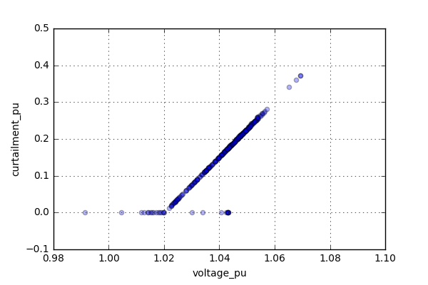

.. _features-in-detail:

Features in detail
==================

Data import
-----------

Power flow analysis
-------------------

.. _grid_expansion_methodology:

Automatic grid expansion
-------------------------

General methodology
^^^^^^^^^^^^^^^^^^^^^^^^^^

The grid expansion methodology is conducted in :py:mod:`~edisgo.flex_opt.reinforce_grid`.

For now only a combined analysis of MV and LV grids is possible.
The order grid expansion measures are conducted is as follows:

* Reinforce transformers and lines due to over-loading issues
* Reinforce lines in MV grid due to over-voltage issues
* Reinforce lines in LV grid due to over-loading issues
* Reinforce transformers and lines due to over-loading issues

Reinforcement of transformers and lines due to over-loading issues is performed twice, once in the beginning and again after fixing over-voltage problems,
because the changed power flows after reinforcing the grid may lead to new over-loading issues.

Identification of over-voltage and over-loading issues
^^^^^^^^^^^^^^^^^^^^^^^^^^^^^^^^^^^^^^^^^^^^^^^^^^^^^^^^

Identification of over-voltage and over-loading issues is conducted in :py:mod:`~edisgo.flex_opt.check_tech_constraints`.

Check LV and MV line load
"""""""""""""""""""""""""""""""""""""

  Uses a given load factor and the maximum allowed current given by the manufacturer to calculate the allowed
  line load of each LV and MV line. If the line load calculated in the power flow analysis exceeds the allowed line load the line is reinforced (see :ref:`grid-expansion-measure-line-load-label`).

Check HV/MV station load
"""""""""""""""""""""""""""""""""""""

  Uses a given load factor and the maximum allowed apparent power given by the manufacturer to calculate the allowed
  apparent power of the HV/MV station. If the apparent power calculated in the power flow analysis exceeds the allowed apparent power the station is reinforced (see :ref:`grid-expansion-measure-mv-station-load-label`).

Check MV/LV station load
"""""""""""""""""""""""""""""""""""""

  Uses a given load factor and the maximum allowed apparent power given by the manufacturer to calculate the allowed
  apparent power of each MV/LV station. If the apparent power calculated in the power flow analysis exceeds the allowed apparent power the station is reinforced (see :ref:`grid-expansion-measure-lv-station-load-label`).

Check line and station voltage deviation
""""""""""""""""""""""""""""""""""""""""""

  Uses a given allowed voltage deviation. If the voltage of an LV or MV line calculated in the power flow analysis exceeds the allowed voltage deviation the line is reinforced (see :ref:`grid-expansion-measure-lv-station-voltage-label` or
  :ref:`grid-expansion-measure-line-voltage-label`)

Grid expansion measures
^^^^^^^^^^^^^^^^^^^^^^^^^^

Reinforcement measures are conducted in :py:mod:`~edisgo.flex_opt.reinforce_measures`.

.. _grid-expansion-measure-line-load-label:

Reinforce lines due to over-loading
"""""""""""""""""""""""""""""""""""""

  In a first step a parallel line of the same line type is installed. If this does not solve the over-loading issue as many parallel standard lines as needed are installed.

.. _grid-expansion-measure-mv-station-load-label:

Reinforce HV/MV station due to over-loading issues
"""""""""""""""""""""""""""""""""""""""""""""""""""""
 
  In a first step a parallel transformer of the same type as the existing transformer is installed. If there is more than one transformer in the station the smallest transformer
  that will solve the over-loading issue is used. If this does not solve the over-loading issue as many parallel standard transformers as needed are installed.

.. _grid-expansion-measure-lv-station-load-label:

Reinforce MV/LV station due to over-loading issues
"""""""""""""""""""""""""""""""""""""""""""""""""""""

  In a first step a parallel transformer of the same type as the existing transformer is installed. If there is more than one transformer in the station the smallest transformer
  that will solve the over-loading issue is used. If this does not solve the over-loading issue as many parallel standard transformers as needed are installed.

.. _grid-expansion-measure-lv-station-voltage-label:

Reinforce MV/LV station due to over-voltage issues
"""""""""""""""""""""""""""""""""""""""""""""""""""""

  A parallel standard transformer is installed. Afterwards a power flow analysis is conducted and the voltage is rechecked. If there are still voltage issues the process of installing
  a parallel standard transformer and conducting a power flow analysis is repeated until voltage issues are solved.

.. _grid-expansion-measure-line-voltage-label:

Reinforce lines due to over-voltage
"""""""""""""""""""""""""""""""""""""""""""""""""""""

  In the case of several voltage problems the path to the node with the highest voltage deviation is reinforced first. Therefore, the line between the secondary side of the station and the 
  node with the highest voltage deviation is disconnected at a distribution substation after 2/3 of the path length. If there is no distribution substation where the line can be
  disconnected, the node is directly connected to the busbar. If the node is already directly connected to the busbar a parallel standard line is installed.
 
  Only one voltage problem for each main route is considered at a time since each measure effects the voltage of each node in that route.

  After each main route with voltage problems has been considered a power flow analysis is conducted and the voltage rechecked. The process of solving voltage issues is repeated until voltage issues are solved
  or until the maximum number of allowed iterations is reached.

Grid expansion costs
^^^^^^^^^^^^^^^^^^^^^^^^^^

Total grid expansion costs are the sum of costs for each added transformer and line.
Costs for lines and transformers are only distinguished by the voltage level they are installed in 
and not by the different types. 
In the case of lines it is further taken into account wether the line is installed in a rural or an urban area whereas rural areas
are areas with a population density smaller or equal to 500 people per km² and urban areas are defined as areas
with a population density higher than 500 people per km² [DENA]_. 
The population density is calculated by the population and area of the grid district the line is in (See :class:`~.grid.grids.Grid`).

Costs for lines of aggregated loads and generators are not considered in the costs calculation since grids of
aggregated areas are not modeled but aggregated loads and generators are directly connected to the MV busbar.

Curtailment
-----------

Implementation
^^^^^^^^^^^^^^
The Curtailment methodology is conducted in :py:mod:`~edisgo.flex_opt.curtailment`.

The curtailment function is essentially used to spatially distribute the power required to be curtailed (henceforth
referred to as 'curtailed power') to the various generating units inside the grid. This provides a simple interface
to curtailing the power of generators of either a certain type (eg. solar or wind) or generators in a give weather
cell or both.

The current implementations of this are:

* `curtail_all`
* `curtail_voltage`

with other more complex and finer methodologies in development. The focus of these methods is to try and reduce the
requirement for network reinforcement by alleviating either node over-voltage or line loading issues or both. While
it is possible to curtail specific generators internally, a user friendly implementation is still in the works.

Concept
^^^^^^^

.. _curtailment-basic-label:

Basic curtailment
"""""""""""""""""""""""
In each of the curtailment methods, first the feedin of each of the individual fluctuating generators are
calculated based on the normalized feedin time series per technology and weather cell id from the OpenEnergy
database and the individual generators' nominal capacities.

.. math::
    feedin = feedin_{\text{normalized per type or weather cell}} \times \\
    nominal\_power_{\text{single generators}}

Once the feedin is calculated, both the feedin per generator and curtailed power are normalized and multiplied to get
the curtailed power per generator.

.. math::
    curtailment =
        \frac{feedin}{\sum feedin} \times  total\_curtailment_{\text{normalized per type or weather cell}}

This curtailment is subtracted from the feedin of the generator to obtain the power output of the generator after
curtailment.
_{\text{single generators}}

Feedin factor
"""""""""""""
The case discussed in :ref:`curtailment-basic-label` is for equally curtailing all generators
of a given type or weather cell. To induce a bias in the curtailment of the generators based on a parameter
of our choosing like voltage or line loading, we use a feedin factor, which is essentially a scalar value which
is used to modify the feedin based on this parameter.

.. math::
    modified\_feedin = feedin \times feedin\_factor

and the resulting curtailment is:

.. math::
    curtailment = \frac{modified\_feedin}{\sum modified\_feedin} \times
            total\_curtailment_{\text{normalized per type or weather cell}}

The way this influences the curtailment is that when the the feedin for a particular generator is increased by
multiplication, it results in a higher curtailment of power in this specific generator. Similarly the converse,
where when the feedin for a particular generator is reduced the curtailment for this specific generator is also
reduced. The modified feedin also allows the total curtailed power to remain the same even with the inclusion of
the biasing due to the feedin factor.

The feedin factor is only used as a weighing factor to increase or decrease the curtailment and this in no way
affects the base feedin of the generator.

Spatially biased curtailment methods
^^^^^^^^^^^^^^^^^^^^^^^^^^^^^^^^^^^^

Curtailment biased by node voltage
""""""""""""""""""""""""""""""""""

This is implemented in the methodology using the keyword argument :py:mod:`edisgo.flex_opt.curtailment.curtail_voltage`.
Here the feedin factor is used to bias the curtailment such that there more power is curtailed at nodes with higher
voltages and lesser power is curtailed at nodes with lower voltages. This essentially is a linear characteristic
between curtailed power and voltage, the higher the voltage, the higher the curtailed power. The characteristic is
as shown in :numref:`curtailment_voltage_characteristic_label`

A lower voltage threshold is defined, where no curtailment is assigned if the voltage at the node is lower than this
threshold voltage. The assigned curtailment to the other nodes is directly proportional to the difference of the
voltage at the node to the lower voltage threshold.

.. _curtailment_voltage_characteristic_label:

    Per unit curtailment versus per unit node voltage characteristic used under the method
    :py:mod:`edisgo.flex_opt.curtailment.curtail_voltage`

References
----------

.. [DENA] A.C. Agricola et al.:
    *dena-Verteilnetzstudie: Ausbau- und Innovationsbedarf der Stromverteilnetze in Deutschland bis 2030*. 2012.
