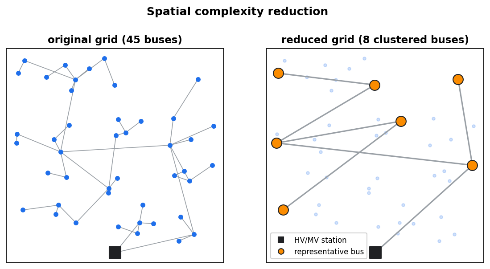

.. _complexity-reduction:

Complexity reduction
====================

Large grids analysed over many time steps can be slow and memory-hungry. eDisGo can
reduce both the **spatial** size (number of buses) and the **temporal** size (number
of time steps) of a problem.

Spatial complexity reduction
----------------------------

In plain terms
~~~~~~~~~~~~~~

Spatial reduction merges nearby buses into a smaller set of representative buses,
keeping the electrical behaviour as close as possible to the original grid. This
shrinks the grid for faster power flow and optimisation.

   Spatial complexity reduction clusters buses *along the grid* into a smaller set of
   representative buses. Because the clusters are connected parts of the grid, the
   reduced grid stays radial — each reduced line aggregates real lines.

How it works
~~~~~~~~~~~~

Call :meth:`~edisgo.edisgo.EDisGo.spatial_complexity_reduction`. The procedure has
two steps: a *busmap* is built that maps every original bus to a clustered bus, and
the eDisGo object is then reduced according to that busmap (lines are recalculated
and sometimes merged). Parts of the method are based on the spatial clustering of
[PyPSA]_.

All buses must have coordinates so that line lengths can be derived from the
Euclidean distance and a detour factor. If your grid has no coordinates, set
``apply_pseudo_coordinates=True`` (the default) to compute coordinates from the
radial grid topology.

Parameters:

* ``mode`` — the clustering method:

  * ``"kmeans"`` — assign buses to K-Means cluster centres.
  * ``"kmeansdijkstra"`` — assign to the nearest cluster centre along the grid graph
    (Dijkstra distance).
  * ``"aggregate_to_main_feeder"`` — assign to the nearest node of the main feeder
    (the longest path in the feeder).
  * ``"equidistant_nodes"`` — place nodes equidistantly along the main feeder.

* ``cluster_area`` — where clustering is applied: ``"grid"``, ``"feeder"`` or
  ``"main_feeder"``. Note that ``"aggregate_to_main_feeder"`` and ``"equidistant_nodes"``
  only work with ``cluster_area="main_feeder"``.
* ``reduction_factor`` — :math:`n_\text{buses} = k_\text{reduction}\cdot
  n_\text{buses, cluster area}`; a smaller factor means a stronger reduction.
* ``reduction_factor_not_focused`` — reduce *non-critical* areas (no voltage or
  overloading problems in the worst case) more strongly than the focus areas.

For more control you can run the underlying functions directly:

.. code-block:: python

    from edisgo.tools.spatial_complexity_reduction import make_busmap, apply_busmap
    from edisgo.tools.pseudo_coordinates import make_pseudo_coordinates

    edisgo_obj = make_pseudo_coordinates(edisgo_obj)
    busmap_df = make_busmap(
        edisgo_obj,
        mode="kmeans",
        cluster_area="feeder",
        reduction_factor=0.25,
    )
    edisgo_reduced, linemap_df = apply_busmap(edisgo_obj, busmap_df)

See [SCR]_ and [HoerschBrown]_ for the theory.

Temporal complexity reduction
-----------------------------

The number of analysed time steps can be reduced by keeping only the grid-critical
ones. :meth:`~edisgo.edisgo.EDisGo.reinforce` does this when called with
``reduced_analysis=True``: it picks the most critical steps with
:func:`~edisgo.tools.temporal_complexity_reduction.get_most_critical_time_steps`
(ranked by the worst voltage and line-loading issues, by default weighted by the
estimated grid-expansion costs; whole worst-case *intervals* can be selected with
:func:`~edisgo.tools.temporal_complexity_reduction.get_most_critical_time_intervals`).

The flexibility optimisation uses a separate step selection in
``edisgo.opf.timeseries_reduction`` —
:func:`~edisgo.opf.timeseries_reduction.get_steps_curtailment` and
:func:`~edisgo.opf.timeseries_reduction.get_steps_storage` *select and expand* the
critical time steps, while
:func:`~edisgo.opf.timeseries_reduction.get_linked_steps` then groups them into
representative steps for the OPF.

Memory
------

:meth:`~edisgo.edisgo.EDisGo.reduce_memory` downcasts the stored time-series, results,
heat-pump and overlying-grid DataFrames to smaller dtypes (``float32`` by default),
lowering memory use without changing the grid.

References
----------

.. [PyPSA] `PyPSA — Spatial Clustering documentation
   <https://docs.pypsa.org/v0.35.1/examples/spatial-clustering.html>`_

.. [SCR] Malte Jahn, *Analyse der Auswirkungen räumlicher Komplexitätsreduktion auf
   die Verteilnetzausbauplanung mit Flexibilitäten* (in German; "Analysis of the
   effects of spatial complexity reduction on distribution grid expansion planning
   with flexibilities"), master's thesis, Technische Universität Berlin (in
   cooperation with the Reiner Lemoine Institut), 2022.
   `PDF <https://reiner-lemoine-institut.de/wp-content/uploads/2024/09/2022_MA_Malte_Jahn_Raeumliche_Komplexitaetsreduktion.pdf>`__
   The four clustering modes offered by
   :meth:`~edisgo.edisgo.EDisGo.spatial_complexity_reduction` (``"kmeans"``,
   ``"kmeansdijkstra"``, ``"aggregate_to_main_feeder"`` and ``"equidistant_nodes"``)
   and the ``reduction_factor_not_focused`` option for reducing non-critical areas
   more strongly are developed and evaluated there.

.. [HoerschBrown] Jonas Hörsch, Tom Brown: *The role of spatial scale in joint
   optimisations of generation and transmission for European highly renewable
   scenarios*, `arXiv:1705.07617 <https://arxiv.org/abs/1705.07617>`_.
