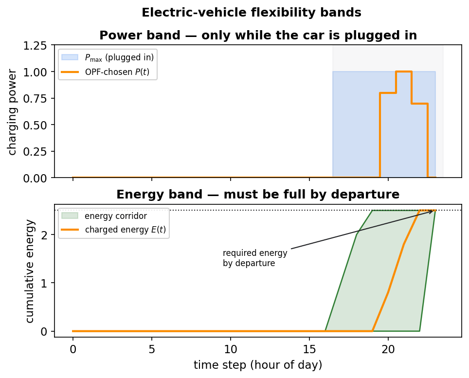

.. _electromobility-methodology:

Electromobility
===============

In plain terms
--------------

Electric vehicles are a large but *shiftable* load: a car must be charged before it
leaves, but *when* it charges in between can often be chosen freely. eDisGo models
this and offers both simple rule-based charging strategies and full optimisation.

Data and allocation
-------------------

EV data is held in :class:`~edisgo.network.electromobility.Electromobility`:

* ``charging_processes_df`` — one row per charging event (from
  `SimBEV <https://github.com/rl-institut/simbev>`_): use case (home/work/public/hpc),
  nominal charging power, energy demand, and the park start/end time steps.
* ``potential_charging_parks_gdf`` — candidate charging-point locations (from
  `TracBEV <https://github.com/rl-institut/tracbev>`_), with a weighting factor.
* ``integrated_charging_parks_df`` — the parks that were connected to the grid (also
  appear in ``topology.charging_points_df``).

Allocation of charging demand to charging points is done in
:py:func:`~edisgo.io.electromobility_import.distribute_charging_demand`. **Private**
charging (home/work) gets one charging point per vehicle, selected randomly and
weighted by the TracBEV factor
(:py:func:`~edisgo.io.electromobility_import.distribute_private_charging_demand`).
**Public** charging is allocated per process: an existing point is reused if it is
free and powerful enough, otherwise a new one is chosen the same weighted way
(:py:func:`~edisgo.io.electromobility_import.distribute_public_charging_demand`).

Grid integration
----------------

Once the charging points carry their demand, the parks are connected to the grid by
:py:func:`~edisgo.io.electromobility_import.integrate_charging_parks`. The decisive
quantity is each park's **grid connection capacity**, which is deliberately *not* the
plain sum of its charging-point ratings:

#. The **gross capacity** is the summed (loss-corrected) peak power of every charging
   point in the park
   (:attr:`~edisgo.network.components.PotentialChargingParks.designated_charging_point_capacity`).
#. A size-dependent **simultaneity (diversity) factor** is applied
   (:func:`~edisgo.io.electromobility_import.determine_grid_connection_capacity`):
   small parks are connected in full (factor ``1.0``), parks of 1 MW gross and above
   are reduced to 45 % (factor ``0.45``), and in between the factor ramps down
   linearly. The rationale: the more charging points a site has, the less likely they
   all draw peak power at the same instant. High-power-charging (``hpc``) sites are the
   exception and are connected at full capacity.
#. The result becomes the charging point's ``p_set``, which determines the **voltage
   level** it is connected to and how the connection is sized — and hence how much grid
   reinforcement the charging demand ultimately triggers.

Using the gross sum directly would systematically oversize the connections (and the
reinforcement); the diversity factor keeps the integration realistic.

.. _charging-strategies:

Charging strategies (heuristic)
-------------------------------

Rule-based strategies are applied with
:meth:`~edisgo.edisgo.EDisGo.apply_charging_strategy`
(:py:func:`~edisgo.flex_opt.charging_strategies.charging_strategy`). Every strategy
must fully cover each charging requirement. Only the **private** use cases — ``home``
and ``work`` — are shifted; ``public`` and high-power (``hpc``) charging is always
charged "dumb", as it prioritises immediate service:

* ``"dumb"`` — charge at maximum power immediately on arrival. No flexibility; the
  worst case for the grid.
* ``"reduced"`` — *preventive*: charge at the **minimum** power that still fully
  charges the car during its parking time (controlled by
  ``minimum_charging_capacity_factor``), spreading the load out.
* ``"residual"`` — *active*: charge when the residual load in the MV grid is lowest
  (high generation, low consumption); processes with little flexibility get priority.

So the ``"dumb"`` strategy charges *every* use case immediately, while ``"reduced"`` and
``"residual"`` shift only ``home`` and ``work`` and leave ``public``/``hpc`` dumb. Either
way, after :meth:`~edisgo.edisgo.EDisGo.apply_charging_strategy` *every* charging point
has an active-power series — none are left unset — which is what a subsequent power flow
or the :ref:`optimisation <flexibility-opf>` needs (the optimisation reschedules only the
charging points passed as flexible and keeps the rest as fixed load).

Flexibility bands (for optimisation)
------------------------------------

For the optimal power flow, each flexible charging point is described by bands
computed with
:meth:`~edisgo.network.electromobility.Electromobility.get_flexibility_bands`:

* ``upper_power`` — the maximum charging power available at each time step (zero when
  the car is not plugged in).
* ``lower_energy`` / ``upper_energy`` — the minimum and maximum *cumulative* energy
  that may have been charged by each time step.

   Electric-vehicle flexibility bands. The power band is non-zero only while the car
   is plugged in; the energy band guarantees the car is full by departure. The OPF may
   choose any charging profile that stays inside both bands.

Physics
-------

The bands encode two facts. The **power band** follows from the connected charger and
the parking schedule: :math:`0 \le P(t) \le P_\text{max}` only while the car is
parked. The **energy band** guarantees the service: the cumulative charged energy
:math:`E(t)=\sum_{\tau\le t} P(\tau)\,\eta_\text{cp}\,\Delta t` must reach the
required demand by departure and never exceed the battery capacity, i.e.
:math:`E_\text{lower}(t) \le E(t) \le E_\text{upper}(t)`, where
:math:`\eta_\text{cp}` is the charging-point efficiency. Any operation inside these
bands fully serves the user; the OPF picks the grid-friendliest one.

See the :doc:`../../tutorials/electromobility_example` notebook for a worked example,
and :ref:`data-sources` for how to obtain SimBEV/TracBEV data.
