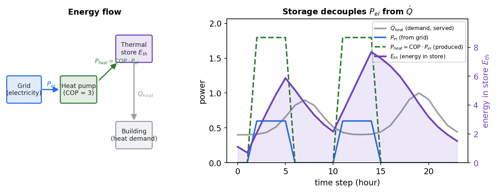

.. _heat-pumps-flex:

Heat pumps
==========

In plain terms
--------------

A heat pump turns electricity into heat very efficiently. If it is paired with a
**thermal storage** (a hot-water buffer), *when* it consumes electricity becomes
flexible: it can run when the grid has room and store the heat for later. Without a
buffer it simply follows the heat demand.

Data
----

Heat-pump data is held in :class:`~edisgo.network.heat.HeatPump`:

* ``cop_df`` — the time-varying **coefficient of performance** (COP) per heat pump.
* ``heat_demand_df`` — the heat demand to be served, per heat pump / building, per
  time step.
* ``thermal_storage_units_df`` — thermal-storage capacity, efficiency and initial
  state of charge, where present.

COP and heat-demand series can be set from the OEP or from your own data via
:meth:`~edisgo.network.heat.HeatPump.set_cop` and
:meth:`~edisgo.network.heat.HeatPump.set_heat_demand`. Heat pumps appear in
``topology.loads_df`` with ``type == "heat_pump"``.

Operation
---------

:meth:`~edisgo.edisgo.EDisGo.apply_heat_pump_operating_strategy`
(:py:func:`~edisgo.flex_opt.heat_pump_operation.operating_strategy`) currently
implements the ``"uncontrolled"`` strategy: the electrical load directly follows the
heat demand,

.. math::

   P_\text{el}(t) = \frac{\dot Q_\text{heat}(t)}{\text{COP}(t)} .

This sets the heat pump's series in ``timeseries.loads_active_power``.

Flexible operation (for optimisation)
-------------------------------------

When a heat pump has a thermal storage and is passed to
:meth:`~edisgo.edisgo.EDisGo.pm_optimize` via ``flexible_hps``, the OPF may decouple
electrical consumption from heat demand within the storage limits. The thermal
state of energy evolves as it is charged (heat produced by the pump, scaled by the
store's efficiency :math:`\eta`) and discharged (heat demand served),

.. math::

   E_\text{th}(t+1) = E_\text{th}(t) + \big(\eta\,\text{COP}(t)\,P_\text{el}(t)
   - \dot Q_\text{heat}(t)\big)\,\Delta t ,
   \qquad 0 \le E_\text{th}(t) \le E_\text{th,max},

so the pump can pre-heat the buffer when it is grid-friendly and coast later. The
store also has standing losses (the OPF applies a per-hour self-discharge factor), and
the COP couples the *electrical* power the grid sees to the *thermal* power the
building needs.

   A heat pump with thermal storage. The pump turns grid electricity :math:`P_{el}`
   into heat :math:`P_{heat}=\mathrm{COP}\cdot P_{el}`; the store buffers the
   difference to the heat demand :math:`\dot Q_{heat}` (right axis = energy in the
   store). So the pump can pre-heat when the grid has room and coast later.
