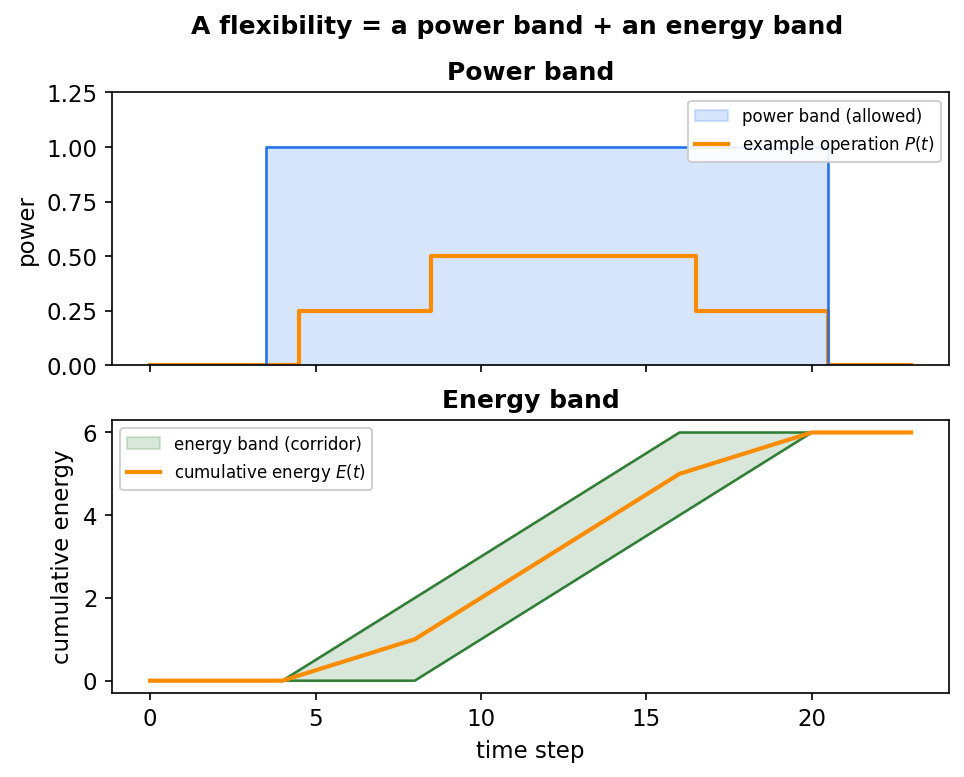
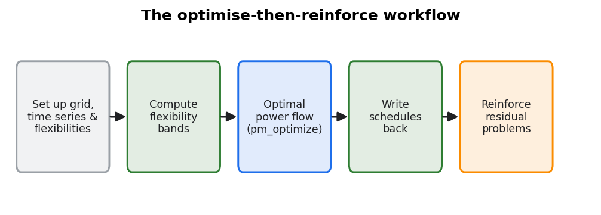
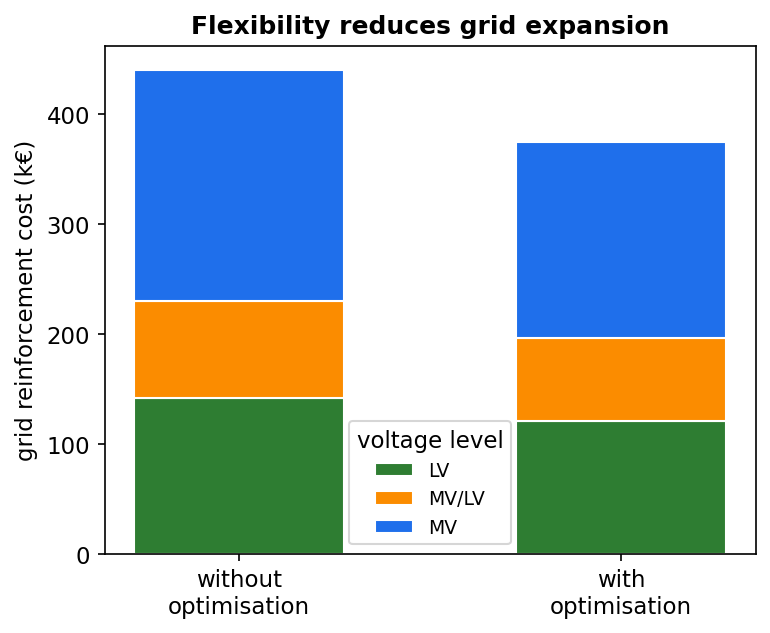

.. _flexibility-overview:

Flexibility & optimisation
==========================

In plain terms
--------------

Conventional grid planning answers congestion with copper: thicker cables and bigger
transformers. But many components in a modern distribution grid can *shift their
power in time* — electric vehicles can charge a few hours later, heat pumps can run
when a thermal store has room, batteries can charge and discharge, industrial
processes can be moved. eDisGo calls these **flexibilities** and can schedule them so
that the grid stays within limits, reducing or avoiding reinforcement. This part of
the documentation explains how each flexibility is modelled and how they are
optimised together.

The idea: power and energy bands
--------------------------------

Every flexibility is described by **bands** — limits within which its operation may
be moved without violating the user's needs:

* a **power band** — how much power the component may draw or feed at each time step
  (e.g. an EV charger's maximum power while the car is plugged in), and
* an **energy band** — how much cumulative energy must / may have flowed by each
  time step (e.g. the car must be full before it leaves; a thermal or battery store
  may not over- or undercharge).

The optimisation is free to choose any operation inside these bands. The bands are
what turn "an EV", "a heat pump" or "a DSM load" into a mathematically optimisable
flexibility.

   Every flexibility is expressed as a **power band** (the allowed power at each time
   step) and an **energy band** (the cumulative-energy corridor). Any trajectory that
   stays inside both bands fully serves the user; the optimisation picks the
   grid-friendliest one.

The optimise-then-reinforce loop
--------------------------------

A typical flexibility study is:

#. set up the grid, the (inflexible) time series and the flexibilities;
#. compute the flexibility bands;
#. run the optimal power flow
   (:meth:`~edisgo.edisgo.EDisGo.pm_optimize`) to obtain grid-friendly operation
   schedules;
#. write those schedules back into the time series and **reinforce** the (hopefully
   much smaller) residual problems.

   The optimise-then-reinforce workflow: compute the flexibility bands, schedule the
   flexibilities with the optimal power flow, write the schedules back, and reinforce
   only the residual problems.

Comparing the reinforcement cost with and without the optimisation quantifies how
much grid expansion the flexibility saves.

   Reinforcement cost with and without the flexibility optimisation, by voltage level
   (illustrative). The difference is the grid expansion that the flexibility avoids.

The optimisation model
----------------------

Step 3 of that loop — the optimal power flow — is the mathematical heart of eDisGo's
flexibility handling. It represents the grid with an **AC branch-flow model** and, in a
single multi-period optimisation, chooses operation schedules for every flexibility
that minimise grid stress (line losses and, depending on the settings, line loading,
voltage and overlying-grid violations) while keeping each flexibility inside its power
and energy bands. Because shifting energy in time only couples components *across* time
steps, all time steps are optimised jointly.

The full formulation — the decision variables, the objective, the branch-flow and
flexibility constraints, and how the non-convex AC equations are handled via a
second-order-cone relaxation — is described in :ref:`flexibility-opf`. The model was
developed in, and is documented in full mathematical detail in, the master's thesis it
is based on:

   Maike Held, *Netzdienlich optimaler Einsatz von Flexibilitäten in radialen
   Verteilnetzen basierend auf einem AC-Lastflussmodell* (in German), master's thesis,
   Technische Universität Berlin (in cooperation with the Reiner Lemoine Institut),
   2023.
   `PDF <https://reiner-lemoine-institut.de/wp-content/uploads/2023/09/2023_MA_Maike_Held_Netzdienlich_optimaler_Einsatz_von_Flexibilitaeten.pdf>`__

which is the recommended reference for readers who want the complete derivation.

What is flexible
----------------

.. list-table::
   :header-rows: 1
   :widths: 22 18 60

   * - Flexibility
     - Container
     - Page
   * - Electric vehicles
     - :class:`~edisgo.network.electromobility.Electromobility`
     - :ref:`electromobility-methodology`
   * - Heat pumps (+ thermal storage)
     - :class:`~edisgo.network.heat.HeatPump`
     - :ref:`heat-pumps-flex`
   * - Demand side management
     - :class:`~edisgo.network.dsm.DSM`
     - :ref:`dsm-flex`
   * - Battery / home storage
     - ``topology.storage_units_df``
     - :ref:`storage-flex`
   * - Reactive power
     - —
     - :ref:`reactive-power-flex`
   * - Overlying-grid requirements
     - :class:`~edisgo.network.overlying_grid.OverlyingGrid`
     - :ref:`overlying-grid-flex`

The optimisation that ties them together is described in :ref:`flexibility-opf`. For
*all* eDisGo component types — grid components as well as these flexibilities — see
:ref:`components`.

.. toctree::
   :maxdepth: 1
   :hidden:

   optimization_opf
   electromobility
   heat_pumps
   dsm
   storage
   reactive_power
   overlying_grid
