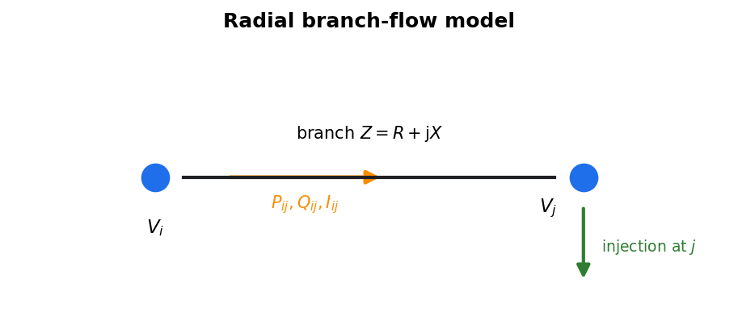
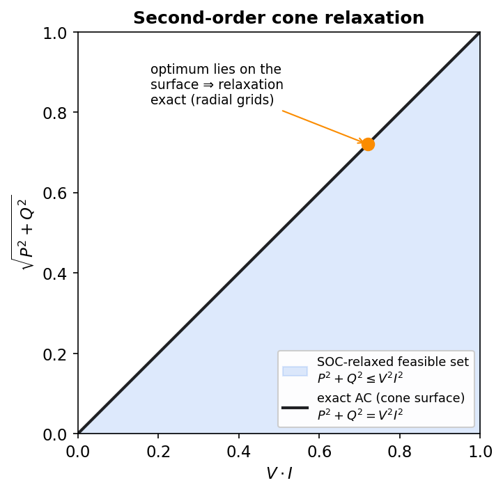

.. _flexibility-opf:

Multi-period optimal power flow
===============================

In plain terms
--------------

The optimal power flow (OPF) is the engine that schedules all flexibilities at once.
Given the grid, the inflexible loads/generation and the flexibility bands
(:ref:`flexibility-overview`), it finds operation schedules for electric vehicles,
heat pumps, DSM loads and storage that keep voltages and loadings as healthy as
possible — so that little or no grid reinforcement is needed — while respecting every
component's bands. It is a *multi-period* OPF: all time steps are optimised together,
because shifting energy in time only makes sense across time.

.. note::

   The model summarised on this page is developed and described in full mathematical
   detail in the master's thesis it is based on:

      Maike Held, *Netzdienlich optimaler Einsatz von Flexibilitäten in radialen
      Verteilnetzen basierend auf einem AC-Lastflussmodell* (in German), master's
      thesis, Technische Universität Berlin (in cooperation with the Reiner Lemoine
      Institut), 2023.
      `PDF <https://reiner-lemoine-institut.de/wp-content/uploads/2024/09/2023_MA_Maike_Held_Netzdienlich_optimaler_Einsatz_von_Flexibilitaeten.pdf>`__

   The equation numbers used below (``Eq. (3.x)``) follow chapter 3 of that thesis,
   and the Julia source comments use the same numbering. Consult the thesis for the
   complete derivation, the modelling assumptions and the validation.

How to run it
-------------

.. code-block:: python

    edisgo.pm_optimize(
        flexible_cps=flexible_cps,            # EV charging points
        flexible_hps=flexible_hps,            # heat pumps with thermal storage
        flexible_loads=flexible_loads,        # DSM loads
        flexible_storage_units=flexible_storage,
        opf_version=2,
        method="soc",
    )

:meth:`~edisgo.edisgo.EDisGo.pm_optimize` exports the grid and the flexibility bands,
runs the optimisation in a **Julia** subprocess using
`PowerModels.jl <https://lanl-ansi.github.io/PowerModels.jl/stable/>`_, and writes
the resulting operation schedules back into ``edisgo.timeseries`` (and the heat /
slack results into ``edisgo.results``). The Julia/Gurobi prerequisites are described
in :ref:`opf-requirements`.

The four flexibility arrays select which components may be optimised; any component
not listed keeps its given time series. Non-flexible storage units operate to
optimise self-consumption rather than being scheduled by the OPF.

The grid model: radial branch flow
-----------------------------------

eDisGo's OPF uses a **radial branch flow model (BFM)** — the natural formulation for
the tree-shaped distribution grids ding0 produces.

   Radial branch-flow model: for each branch :math:`i \to j` the model couples the
   sending-end power :math:`(P_{ij}, Q_{ij})`, the branch current :math:`I_{ij}` and
   the bus voltages :math:`V_i, V_j`, with a power balance at every bus.

For every branch and bus the model enforces:

* **Power balance** at each bus — injected active and reactive power equals what
  flows out on the branches plus losses.
* **Branch flow / thermal limit** — apparent power on a branch stays within its
  rating, :math:`S = \sqrt{P^2 + Q^2} \le S_\text{lim}`.
* **Voltage limits** — :math:`V_\text{min} \le V \le V_\text{max}` at every bus.
* **Flexibility constraints** — each flexibility's power and energy bands
  (:ref:`flexibility-overview`), e.g. for a store the state of energy must stay
  within :math:`[E_\text{min}, E_\text{max}]` and the charging requirement must be
  met by departure.

The coupling between branch power, current and voltage is the quadratic equality

.. math::

   P^2 + Q^2 = V^2 \cdot I^2 ,

which is what makes an exact AC-OPF non-convex.

All quantities are scaled to per-unit on a common base power ``s_base`` (an argument
of :meth:`~edisgo.edisgo.EDisGo.pm_optimize`, default 1 MVA), which keeps the
optimisation numerically well-conditioned.

Solution method: SOC vs. non-convex
-----------------------------------

The ``method`` argument chooses how that quadratic constraint is handled:

   The SOC relaxation replaces the non-convex equality :math:`P^2+Q^2=V^2 I^2` (the
   cone surface) with the convex inequality :math:`P^2+Q^2 \le V^2 I^2` (the filled
   cone). For radial grids the optimum lies on the surface, so the relaxation is
   usually *exact*.

* ``"soc"`` (default) — a **second-order cone relaxation** replaces the equality
  :math:`P^2+Q^2=V^2 I^2` with the convex inequality :math:`P^2+Q^2 \le V^2 I^2`. The
  resulting convex problem is solved with **Gurobi** and is fast and reliable. For
  radial grids the relaxation is usually *exact* (the inequality is tight at the
  optimum), so the solution is also feasible for the original AC problem; where it is
  not, ``warm_start=True`` (below) recovers a feasible AC solution.
* ``"nc"`` — the **non-convex** problem with the exact equality, solved with the
  **Ipopt** interior-point solver. More accurate in principle but slower and not
  guaranteed to find the global optimum.
* ``warm_start=True`` (with ``method="soc"``) — additionally runs the non-convex
  Ipopt OPF, warm-started from the (exact) Gurobi SOC solution, to polish the result.

Optimisation versions
----------------------

The ``opf_version`` argument selects the objective and which constraints are active.
All versions minimise line losses; they differ in how grid limits and the overlying
(high-voltage) grid are treated:

.. list-table::
   :header-rows: 1
   :widths: 8 40 52

   * - Version
     - Constraints
     - Objective
   * - 1 (default)
     - Grid restrictions **lifted**
     - minimise line losses **and** maximum line loading
   * - 2
     - Standard grid restrictions
     - minimise line losses **and** grid-related slacks
   * - 3
     - HV requirements added; grid restrictions lifted
     - minimise line losses, maximum line loading **and** HV slacks
   * - 4
     - HV requirements added; standard grid restrictions
     - minimise line losses, HV slacks **and** grid-related slacks

"Lifting" the grid restrictions (versions 1 and 3) turns hard voltage/loading limits
into a penalised objective term (maximum loading), which is useful for assessing how
much flexibility *could* help before deciding on reinforcement. Versions 2 and 4 keep
the limits as constraints and penalise the remaining unavoidable violations via
*slack* variables. Versions 3 and 4 additionally honour requirements handed down from
the overlying grid (:ref:`overlying-grid-flex`).

The optimisation model in detail
--------------------------------

This section describes the actual mathematical program eDisGo assembles and hands to
the solver — its decision variables, objective and constraints. It follows the
formulation of Held (2023) (see the note at the top of this page), whose chapter-3
equation numbers (``Eq. (3.x)``) are reused in the Julia source comments; the thesis
holds the full derivation. Each block below maps to functions in the
:doc:`Julia OPF API </reference/julia_api>` (the ``variable_*``, ``constraint_*`` and
``objective_*`` families).

Decision variables
~~~~~~~~~~~~~~~~~~~~

At every optimised time step the solver chooses:

* the **branch-flow state** — the active and reactive branch flows
  :math:`P_{ij}, Q_{ij}`, the squared branch current :math:`I_{ij}^2` and the squared
  bus voltages :math:`V_i^2`;
* the **substation exchange** :math:`P_\text{s}, Q_\text{s}` with the overlying grid at
  the slack bus;
* one **operation variable per flexibility** — battery power :math:`p^\text{bat}`, EV
  charging power :math:`p^\text{ev}`, heat-pump electrical power :math:`p^\text{hp}` and
  DSM shift power :math:`p^\text{dsm}` — together with the **stored-energy** state of
  each store (battery :math:`e^\text{bat}`, EV :math:`e^\text{ev}`, thermal store
  :math:`e^\text{th}`, DSM :math:`e^\text{dsm}`);
* depending on the version, **slack variables** that absorb otherwise-infeasible
  situations (generation curtailment, load shedding, EV and heat-pump shedding,
  heat-pump operation slacks, overlying-grid slacks) and the auxiliary
  maximum-line-loading variable.

Objective
~~~~~~~~~

All versions minimise the **ohmic line losses** :math:`\sum_{ij} I_{ij}^2\, r_{ij}`,
summed over all branches and time steps. This term has a double purpose: besides being
a sensible grid-friendliness goal, it pushes the squared current :math:`I_{ij}^2`
downwards onto the boundary of the SOC relaxation, which keeps that relaxation **tight**
— i.e. its solution stays feasible for the original AC problem. Depending on
``opf_version`` it is combined
with the **maximum line loading** (versions 1 and 3) and/or weighted penalties on the
**slack variables** (versions 2 and 4) and the **overlying-grid requirement slacks**
(versions 3 and 4). The exact combination is the one listed under
`Optimisation versions`_ above, implemented by the ``objective_*`` functions.

Network constraints (per time step)
~~~~~~~~~~~~~~~~~~~~~~~~~~~~~~~~~~~~~

* **Power balance (Kirchhoff's current law)** at every bus — the power arriving on
  incoming branches equals the power leaving on outgoing branches plus the ohmic
  losses, plus the net injection of the generators, loads and flexibilities connected
  to the bus (Eq. (3.3)/(3.4)). Reactive injections of the flexibilities follow from
  their active power via the power factor.
* **Voltage-drop equation** along every branch, relating the squared voltages at its
  two ends to the flows, the squared current and the branch impedance (Eq. (3.5)); the
  slack-bus voltage is fixed to :math:`1\,\text{p.u.}`
* **Current–power–voltage coupling** :math:`P^2 + Q^2 = V^2 I^2` — kept as the exact
  non-convex equality (``method="nc"``) or relaxed to the convex inequality
  :math:`\le` (``method="soc"``); see `Solution method: SOC vs. non-convex`_ above
  (Eq. (3.6)).
* **Voltage limits** :math:`V_\text{min}^2 \le V_i^2 \le V_\text{max}^2` (Eq. (3.8))
  and **thermal / loading limits** — a current limit on every branch (versions 2 and
  4, Eq. (3.7)) or, when the grid restrictions are lifted (versions 1 and 3), the
  maximum-line-loading bound that the objective then minimises (Eq. (3.40)).

Flexibility dynamics (across time steps)
~~~~~~~~~~~~~~~~~~~~~~~~~~~~~~~~~~~~~~~~~~

The flexibilities are what couple the time steps: a store's energy at one step depends
on the previous step and the power chosen in between. With time-step length
:math:`\Delta t` and, where applicable, efficiency :math:`\eta`:

* **Battery / home storage** — the state of energy evolves as
  :math:`e^\text{bat}_t = e^\text{bat}_{t-1} - \Delta t\, p^\text{bat}_t`, starting from
  the given initial charge and returning to a required end value
  (Eq. (3.9)/(3.10)), and stays within :math:`[E_\text{min}, E_\text{max}]`. eDisGo uses
  a *resistance-based* battery model (Stai et al.): each battery is an ideal store at a
  **virtual bus** connected to its real bus through a purely resistive virtual line, so
  that its power-dependent charging/discharging losses appear as ohmic losses on that
  line — this is the "storage branch" that shows up in the branch-flow results.
* **Electric vehicles** — the charged energy accumulates as
  :math:`e^\text{ev}_t = e^\text{ev}_{t-1} + \Delta t\,\eta\, p^\text{ev}_t`
  (Eq. (3.25)/(3.26)); it is pinned to the middle of the energy band at the start and
  end of the horizon, which encodes the charging requirement — the battery must be
  charged by departure.
* **Heat pumps with thermal storage** — the electrical power, through the coefficient
  of performance :math:`\mathrm{COP}`, must cover the building's heat demand plus the
  net (dis)charge of the thermal store
  (:math:`\mathrm{COP}\cdot p^\text{hp}_t = \dot q^\text{demand}_t + \text{(net thermal-store charge)}`,
  Eq. (3.19)); the thermal store has its own energy balance with standing losses
  (Eq. (3.22)/(3.23)).
* **Demand-side management** — the shifted energy
  :math:`e^\text{dsm}_t = e^\text{dsm}_{t-1} + \Delta t\, p^\text{dsm}_t`
  (Eq. (3.32)/(3.33)) stays within the DSM band and must **return to zero** by the end
  of the horizon: shifted load is recovered, not dropped.
* **Overlying-grid requirements** (versions 3 and 4) — the summed dispatch of the
  addressed flexibility must meet the active power requested by the higher voltage
  level, up to a penalised slack (:ref:`overlying-grid-flex`).

Multi-period structure
~~~~~~~~~~~~~~~~~~~~~~~~

Each time step is built as one PowerModels *network*, and the dynamics above link the
battery, EV, heat and DSM states across consecutive networks (the Julia
``build_mn_opf_bf_flex`` assembles this multi-network problem). This is exactly why the
OPF must be solved as one joint multi-period optimisation rather than time step by time
step — and why its size grows with the number of time steps, which
:ref:`complexity-reduction` helps to contain.

Results and slacks
------------------

Operation schedules are written into ``edisgo.timeseries`` (charging-point, heat-pump,
DSM and storage active power) and can then feed a final
:meth:`~edisgo.edisgo.EDisGo.reinforce`. The ``save_heat_storage``, ``save_slack_gen``
and ``save_slacks`` flags control whether heat-storage states, the slack generator and
the optimisation slack variables are stored as well; the exact slack set depends on
``opf_version`` (see :func:`edisgo.io.powermodels_io.from_powermodels`).

Beyond the schedules, the full raw optimisation result is collected in
``edisgo.opf_results``, an
:class:`~edisgo.opf.results.opf_result_class.OPFResults` object. It holds the solver
status and solve time, the per-line branch-flow variables
(:class:`~edisgo.opf.results.opf_result_class.LineVariables`), the heat- and
battery-storage trajectories
(:class:`~edisgo.opf.results.opf_result_class.HeatStorage`,
:class:`~edisgo.opf.results.opf_result_class.BatteryStorage`), the exchange with the
overlying grid, and the grid slack variables — curtailment and load shedding —
(:class:`~edisgo.opf.results.opf_result_class.GridSlacks`). See its API reference for
the full field list.

Performance
-----------

Because all time steps are optimised jointly, the problem grows with both grid size
and the number of time steps. Use :ref:`complexity-reduction` (spatial reduction and
the temporal selection in ``edisgo.opf.timeseries_reduction``) and a per-unit base
``s_base`` to keep the problem tractable.

.. seealso::

   :meth:`~edisgo.edisgo.EDisGo.pm_optimize` and
   :func:`~edisgo.opf.powermodels_opf.pm_optimize` for the full parameter reference.
