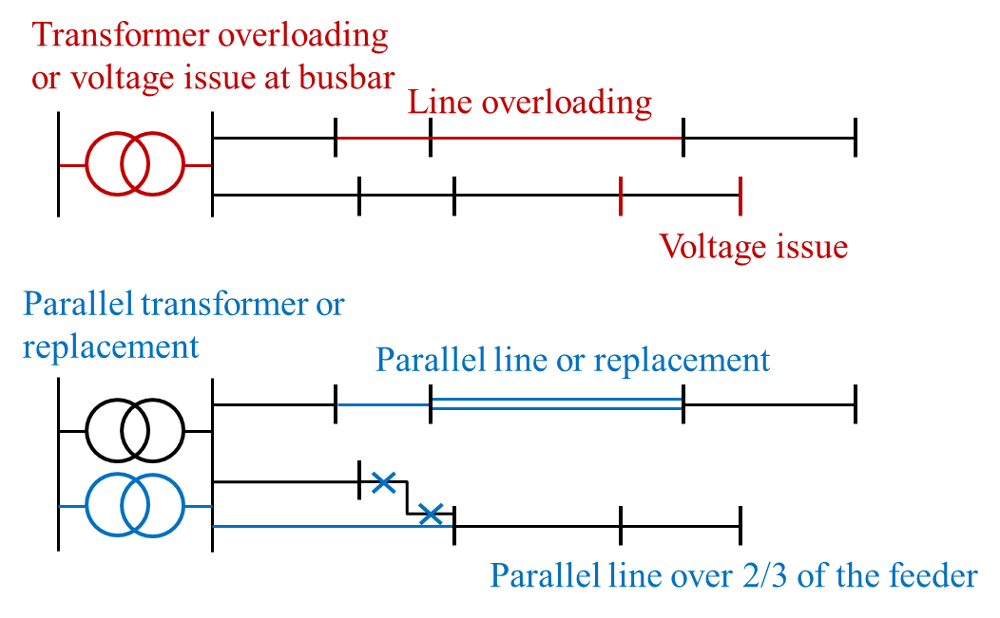

.. _grid-reinforcement:
.. _grid_expansion_methodology:

Grid reinforcement
==================

In plain terms
--------------

*Reinforcement* (grid expansion) is eDisGo's answer to the question "what does it
cost to make this grid handle the load and generation?". It looks for lines and
transformers that are overloaded and buses whose voltage is out of bounds, then
applies the measures a German distribution grid operator would typically use
(parallel cables, bigger/extra transformers, split feeders) until all problems are
solved — and reports the cost.

How it works
------------

Reinforcement is orchestrated by
:py:func:`~edisgo.flex_opt.reinforce_grid.reinforce_grid` (exposed as
:meth:`~edisgo.edisgo.EDisGo.reinforce`). It runs the following measures in order:

#. Reinforce stations and lines due to **overloading**.
#. Reinforce **MV lines** due to voltage issues.
#. Reinforce **distribution substations (MV/LV stations)** due to voltage issues.
#. Reinforce **LV lines** due to voltage issues.
#. Reinforce stations and lines due to overloading **again** — the lower impedance
   created by the voltage measures can produce new overloads.

   Grid reinforcement measures and the order in which issues are identified and
   solved.

Overloading is usually fixed in a single step. Voltage issues can only be solved
**iteratively**: after each measure a power flow is run and the voltages are
re-checked, up to ``max_while_iterations`` times (default 10).

Useful options of :meth:`~edisgo.edisgo.EDisGo.reinforce`:

* ``copy_grid=True`` — compute the needs without changing the grid topology.
* ``mode`` — restrict to ``"mv"``, ``"mvlv"`` or ``"lv"``.
* ``split_voltage_band`` — allocate the allowed voltage band separately to MV and LV
  (default ``True``; see below).
* ``reduced_analysis`` — only analyse the most critical time steps to save time.
* ``catch_convergence_problems=True`` — fall back to
  :py:func:`~edisgo.flex_opt.reinforce_grid.catch_convergence_reinforce_grid`, which
  scales the time series up gradually if the power flow does not converge.

For very large or heavily overloaded grids,
:py:func:`~edisgo.flex_opt.reinforce_grid.enhanced_reinforce_grid` adds fallback
strategies and can separate overloaded LV grids
(:py:func:`~edisgo.flex_opt.reinforce_grid.run_separate_lv_grids`).

Identifying problems
--------------------

Constraint checking lives in
:py:mod:`~edisgo.flex_opt.check_tech_constraints`.

**Overloading** is determined from allowed *load factors*
(:ref:`config_grid_expansion`, section ``grid_expansion_load_factors``), which differ
between load and feed-in case (:ref:`load-feedin-case`).

* Lines: :py:func:`~edisgo.flex_opt.check_tech_constraints.mv_line_max_relative_overload`
  and :py:func:`~edisgo.flex_opt.check_tech_constraints.lv_line_max_relative_overload`
  return lines whose relative loading exceeds 1.0. The allowed and relative loads are
  computed by :py:func:`~edisgo.flex_opt.check_tech_constraints.lines_allowed_load`
  and :py:func:`~edisgo.flex_opt.check_tech_constraints.lines_relative_load`. The
  allowed current uses the manufacturer's ``I_max_th`` (tables
  :ref:`lv_cables_table`, :ref:`mv_cables_table`, :ref:`mv_lines_table`).
* Stations:
  :py:func:`~edisgo.flex_opt.check_tech_constraints.hv_mv_station_max_overload` and
  :py:func:`~edisgo.flex_opt.check_tech_constraints.mv_lv_station_max_overload` use
  the transformer rating ``S_nom`` (tables :ref:`lv_transformers_table`,
  :ref:`mv_transformers_table`);
  :py:func:`~edisgo.flex_opt.check_tech_constraints.stations_relative_load` gives the
  relative loading.

**Voltage problems** are determined by
:py:func:`~edisgo.flex_opt.check_tech_constraints.voltage_issues` against the allowed
deviations in :ref:`config_grid_expansion` (section
``grid_expansion_allowed_voltage_deviations``). With ``split_voltage_band=True``
(default) MV and LV get separate limits — a combined limit can leave almost no room
in the LV grids when the MV deviation is already close to the limit.
:py:func:`~edisgo.flex_opt.check_tech_constraints.voltage_deviation_from_allowed_voltage_limits`
returns the absolute deviations.

Physics
-------

* **Loading / current.** A line's apparent power must stay below
  :math:`S_\text{allowed} = S_\text{nom}\cdot \text{load factor}`, with the current
  :math:`I = S / (\sqrt{3}\,V)`. A transformer's loading uses
  :math:`S = \sqrt{P^2 + Q^2} \le S_\text{nom}\cdot \text{load factor}`.
* **Voltage.** The voltage deviation along a feeder is approximately
  :math:`\Delta V \approx I\,Z` (with line impedance :math:`Z = R + \mathrm{j}X`).
  Allowed deviations follow the German grid codes (e.g. VDE-AR-N 4100 for LV,
  VDE-AR-N 4110 for MV, total deviation per DIN EN 50160). Reinforcement reduces
  :math:`\Delta V` either by lowering :math:`Z` (parallel lines, shorter feeders) or
  by adding transformer capacity.

Reinforcement measures
----------------------

Measures are implemented in :py:mod:`~edisgo.flex_opt.reinforce_measures`.

Lines due to overloading
~~~~~~~~~~~~~~~~~~~~~~~~~~

:py:func:`~edisgo.flex_opt.reinforce_measures.reinforce_lines_overloading` first
adds one parallel line of the same type; if that is not enough, it adds as many
parallel *standard* lines as needed.

Stations due to overloading
~~~~~~~~~~~~~~~~~~~~~~~~~~~~~

:py:func:`~edisgo.flex_opt.reinforce_measures.reinforce_hv_mv_station_overloading`
and :py:func:`~edisgo.flex_opt.reinforce_measures.reinforce_mv_lv_station_overloading`
add a parallel transformer of the existing type (the smallest one that solves the
problem if several exist); otherwise as many standard transformers as needed.

MV/LV stations due to voltage issues
~~~~~~~~~~~~~~~~~~~~~~~~~~~~~~~~~~~~~~

:py:func:`~edisgo.flex_opt.reinforce_measures.reinforce_mv_lv_station_voltage_issues`
installs a parallel standard transformer, re-runs the power flow and repeats until
the voltage is within limits or the iteration limit is reached.

Lines due to voltage issues
~~~~~~~~~~~~~~~~~~~~~~~~~~~~~

:py:func:`~edisgo.flex_opt.reinforce_measures.reinforce_lines_voltage_issues`
addresses the node with the highest deviation first: the line from the station to
that node is split at a distribution substation after 2/3 of the path length (which
lowers the impedance seen by the critical node). If there is no substation to split
at, the node is connected directly to the busbar; if it already is, a parallel
standard line is added. Only one voltage problem per feeder is treated per
iteration, because each measure affects the whole feeder.

Separating overloaded LV grids
~~~~~~~~~~~~~~~~~~~~~~~~~~~~~~~~

:py:func:`~edisgo.flex_opt.reinforce_measures.separate_lv_grid` splits a heavily
overloaded LV grid by adding a new MV/LV station, redistributing the load.

.. _grid-expansion-costs:

Grid-expansion costs
--------------------

Costs are computed by :py:func:`~edisgo.flex_opt.costs.grid_expansion_costs` (with
helpers :py:func:`~edisgo.flex_opt.costs.line_expansion_costs` and
:py:func:`~edisgo.flex_opt.costs.transformer_expansion_costs`). The total is the sum
of the cost of every added transformer and line. Costs are distinguished only by
voltage level, not by equipment type, and for lines additionally by whether they run
in a **rural** (≤ 500 inhabitants/km², lower earthwork cost) or **urban** area
([DENA]_). Lines of aggregated loads/generators connected directly to the MV busbar
are not counted. Unit costs come from :ref:`config_grid_expansion`.

References
----------

.. [DENA] A.C. Agricola et al.: *dena-Verteilnetzstudie: Ausbau- und
   Innovationsbedarf der Stromverteilnetze in Deutschland bis 2030*. 2012.
