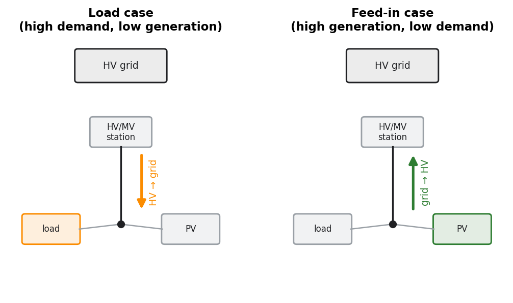

.. _power-flow-methodology:

Power flow analysis
===================

In plain terms
--------------

A *power flow* computes the voltage at every bus and the current/loading on every
line and transformer for a given set of loads and generation. eDisGo uses it to find
where the grid is overloaded or where voltages leave the allowed band. It is the
measurement step that both :ref:`reinforcement <grid-reinforcement>` and the
:ref:`flexibility optimisation <flexibility-opf>` build on.

In a typical eDisGo study the power flow is run over a **whole future-scenario time
series** — not a single assumed situation — so you see *when* and *where* problems
occur across the analysed period.

How it works
------------

:meth:`~edisgo.edisgo.EDisGo.analyze` runs a **non-linear AC power flow** using
`PyPSA <https://pypsa.org>`_. All loads and generators are modelled as **PQ nodes**
(fixed active and reactive power), and the **slack** is placed at the secondary side
of the HV/MV substation — i.e. the overlying grid is assumed to balance the
distribution grid at that point.

The power flow is solved for the time steps in
:attr:`~edisgo.network.timeseries.TimeSeries.timeindex`, or for a subset passed via
the ``timesteps`` argument. Internally the eDisGo object is converted to a PyPSA
network with :meth:`~edisgo.edisgo.EDisGo.to_pypsa`.

Which time series?
------------------

What the power flow is run over is set beforehand. There are two routes:

* **Real future-scenario time series (the main use).** Set a real time index with
  :meth:`~edisgo.edisgo.EDisGo.set_timeindex`, then load the scenario's time series —
  fluctuating generator and conventional-load profiles from the
  `OpenEnergy DataBase <https://openenergyplatform.org/>`_ via
  :meth:`~edisgo.edisgo.EDisGo.set_time_series_active_power_predefined`, and the
  component data (generators, heat pumps, electromobility, …) via the ``import_*``
  methods — all for a ``scenario`` such as ``"eGon2035"``. ``analyze()`` is then run
  over the whole period. This is the workflow eDisGo is built for; see
  :ref:`time-series` and :ref:`data-sources`, and the worked
  :doc:`../tutorials/full_workflow_walkthrough`.
* **Worst-case analysis (a quick alternative).**
  :meth:`~edisgo.edisgo.EDisGo.set_time_series_worst_case_analysis` synthesises just
  two extreme operating points for a fast, conservative planning check, without any
  scenario data (:ref:`worst-case-ts`).

Physics
-------

At each bus the complex nodal power balance must hold,

.. math::

   S_i = P_i + \mathrm{j}\,Q_i = V_i \sum_k Y_{ik}^* \, V_k^*

where :math:`V_i` is the complex bus voltage and :math:`Y` the nodal admittance
matrix built from line and transformer impedances. PyPSA solves this non-linear
system with a Newton–Raphson iteration. The results — bus voltages
(:attr:`~edisgo.network.results.Results.v_res`), apparent powers
(:attr:`~edisgo.network.results.Results.s_res`) and currents
(:attr:`~edisgo.network.results.Results.i_res`) — are then compared against the
technical limits in :ref:`grid-reinforcement`.

.. _load-feedin-case:

Load case and feed-in case
--------------------------

These are **not** a way of running the power flow — they are how each operating point
is *classified* so that the correct limits are checked. The two cases describe
**opposite physical risks**, and each is checked against its **own** limit:

* **Load case** — high demand, low generation. Power flows *from* the HV grid into the
  distribution grid; the risks are overloading from the import and **undervoltage** —
  the voltage *drops* along a feeder. Checked against the allowed voltage **drop** and
  the load-case load factors.
* **Feed-in case** — high generation, low demand. Power flows *back* to the HV grid
  (reverse power flow at the HV/MV substation); the risks are reverse overloading and
  **overvoltage** — the voltage *rises* at the generator buses. Checked against the
  allowed voltage **rise** and the feed-in-case load factors.

The allowed voltage band is **asymmetric** — the permitted rise and drop are different
numbers — which is exactly why it matters which case applies. For example (defaults in
:ref:`config_grid_expansion`), an MV grid may *rise* by 5 % but only *drop* by 1.5 %,
while an LV grid may rise by 3.5 % but drop by 6.5 %. The load factors are likewise set
per case. So "load case / feed-in case" really just answers: *which limit do I check
this operating point against — the undervoltage one or the overvoltage one?*

With **real time series** every analysed time step is classified per grid by the sign
of (:math:`\sum \text{load} - \sum \text{generation}`): positive ⇒ load case, negative
⇒ feed-in case (grid losses are neglected for this classification; see
:meth:`~edisgo.network.timeseries.TimeSeries.timesteps_load_feedin_case`). The
**worst-case analysis** (:ref:`worst-case-ts`) instead builds *only* these two extreme
points directly, from simultaneity (scale) factors in :ref:`config_timeseries`.

.. note::

   Do not confuse this with **worst-case time series**. *Load case / feed-in case* is a
   classification that applies to **any** time series — with real time series every
   single time step is tagged as one or the other. The *worst-case analysis* is just the
   special case where the time series consists of exactly one load-case point and one
   feed-in-case point; that overlap is why the two are easy to mix up, but they are not
   the same thing.

   The two situations, by power-flow direction, that decide which limits apply — not
   the only thing analysed. With real time series each analysed time step falls into
   one of them; the worst-case analysis builds only these two extreme points.

For the non-linear *optimal* power flow used for flexibility scheduling, see
:ref:`flexibility-opf`.
