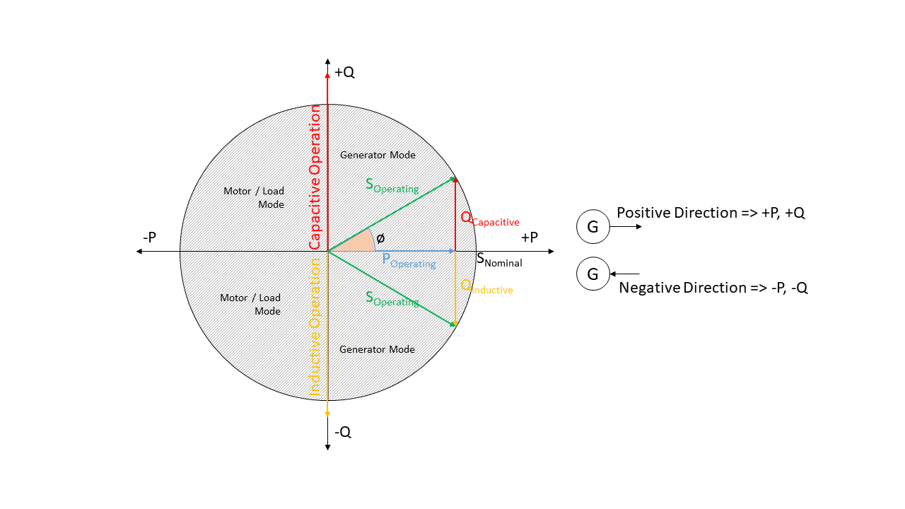
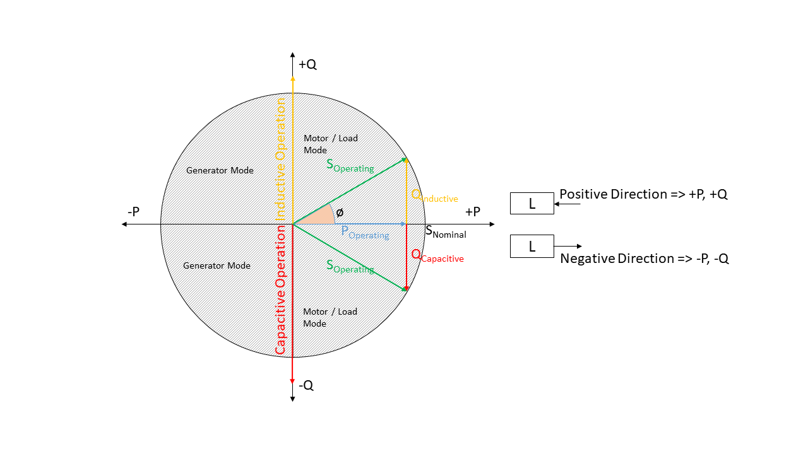

.. _definitions-and-units:

Definitions and units
=====================

Sign convention
---------------

Generators and loads in an AC power system can behave like an inductor or a
capacitor, which corresponds to two different sign conventions — one from the
generator's and one from the load's perspective, defined by the direction of power
flow. Like `PyPSA <https://pypsa.org>`_, eDisGo uses both conventions depending on
the component.

Generator sign convention
^^^^^^^^^^^^^^^^^^^^^^^^^^

.. _generator_sign_convention_label:

   Generator sign convention in detail

Time series for generators and storage units
(:class:`~edisgo.network.components.Generator`,
:class:`~edisgo.network.components.Storage`) use the generator sign convention.

Load sign convention
^^^^^^^^^^^^^^^^^^^^^

.. _load_sign_convention_label:

   Load sign convention in detail

Time series for loads (:class:`~edisgo.network.components.Load`) use the load sign
convention.

Reactive power sign convention
------------------------------

Using the **generator** sign convention, a positive reactive power (Q) means
*capacitive* behaviour and a negative Q means *inductive* behaviour.

Using the **load** sign convention this is reversed: a positive Q means *inductive*
behaviour and a negative Q means *capacitive* behaviour.

See :ref:`reactive-power-flex` for how reactive power is set from a fixed power
factor.

Units
-----

.. csv-table:: List of variables and units
   :file: ../units_table.csv
   :delim: ;
   :header-rows: 1
   :widths: 5, 1, 1, 5
   :stub-columns: 0
